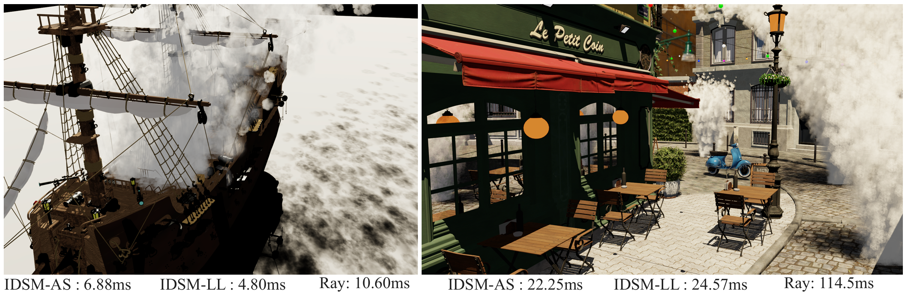
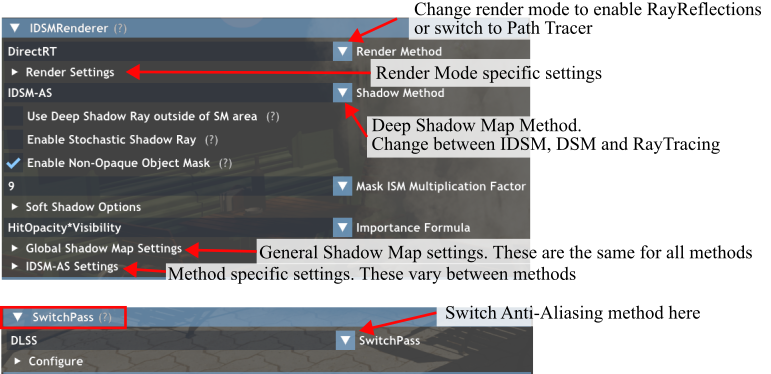
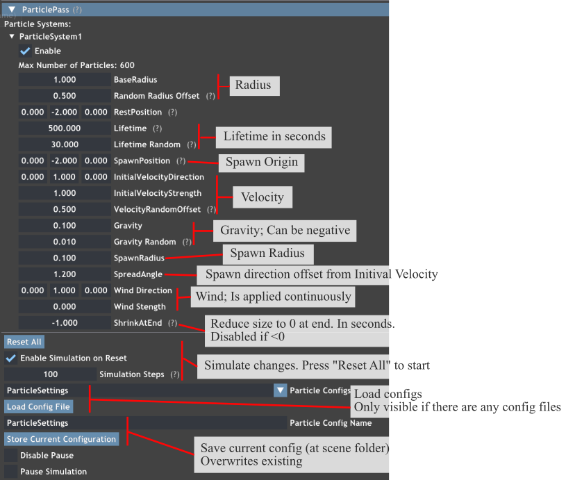

# Real-Time Importance Deep Shadows Maps with Hardware Ray Tracing



## Introduction
This repository contains the source code and an interactive demo for the [the following CGF and EGSR paper:](https://diglib.eg.org/items/ff5055b6-be32-414a-8d63-41fdb7296e10)

> **[Real-Time Importance Deep Shadows Maps
 with Hardware Ray Tracing](https://diglib.eg.org/items/ff5055b6-be32-414a-8d63-41fdb7296e10)** <br>
> René Kern, Felix Brüll, Thorsten Grosch <br>
> TU Clausthal, Germany

This protoype implements Importance Deep Shadow Maps (IDSM), a real-time deep shadow algorithm that adaptively distributes Deep Shadow samples based on importance captured from the current camera viewport. Additionally, we propose a novel DSM data structure built on the ray tracing acceleration structure improving performance for scenarios requiring many samples per DSM texel. We also provide commented Slang (similar to hlsl) shaders for parts of our method [here](#shader-for-paper-methods).

This project was implemented using NVIDIA's Falcor rendering framework. See [README_Falcor.md](README_Falcor.md) for the readme provided with Falcor. This prototype includes multiple anti-aliasing implementations, namely [NVIDIA DLSS](https://github.com/NVIDIA/DLSS), [AMD FSR](https://github.com/GPUOpen-LibrariesAndSDKs/FidelityFX-SDK), and Falcor’s built-in TAA implementation.

The executable demo can be downloaded from the [Releases Page](https://github.com/TU-Clausthal-Rendering/ImportanceDeepShadowMaps/releases/latest). Alternatively the project can be built by following the instructions in [Building Falcor](#building-falcor) or the build instructions in the original [readme](README_Falcor.md).

Teaser:

[](https://youtu.be/BvkLhBASKwY)

## Contents:
* [Shader for Paper Methods](#shader-for-paper-methods)
* [Demo usage](#demo-usage)
* [Testing with more Scenes](#testing-with-more-scenes)
* [Falcor Prerequisites (System requirements)](#falcor-prerequisites)
* [Building Falcor](#building-falcor)

## Shader for Paper Methods
We have seperate (commented) shaders for most steps introduced in the paper. The shaders are written in [Slang](https://github.com/shader-slang/slang), which has similar syntax to hlsl. The following sections have seperate shaders:
- [3.1.2 Distributing the Sample Budget](Source/RenderPasses/IDSMRenderer/ImportanceMapHelpers/DistributeBudget.cs.slang)
- [3.1.3 Creating the Sample Distribution](Source/RenderPasses/IDSMRenderer/ImportanceMapHelpers/GenSampleDistribution.cs.slang)
- [3.2.1 Creating Rays from the Sample Distribution](Source/RenderPasses/IDSMRenderer/ImportanceMapHelpers/RaySampleFromSampleDistribution.slang)
- [3.2.2 Acceleration Structure (Sample from the IDSM AS)](Source/RenderPasses/IDSMRenderer/IDSMAccelerationStructure/IDSMAccelerationStructure.slang)
- [3.2.3 Linked List (Fetch head buffer index)](Source/RenderPasses/IDSMRenderer/ImportanceMapHelpers/HeadIndexFromSampleDistribution.slang)

## Demo usage
After downloading the demo from the release page, it can be executed using the `IDSMDemo_[SceneName].bat` file. We provide four scenes with the Demo which are located in the `scenes` folder. Two of the scenes require downloading additional resources ([Emerald Square](https://developer.nvidia.com/orca/nvidia-emerald-square) and [Lumberyard Bistro](https://developer.nvidia.com/orca/amazon-lumberyard-bistro)). For more info on how to load your own scenes see the [Testing with more Scenes](#testing-with-more-scenes) section.

To change the settings of our algorithm, navigate to the `IDSMRenderer` group in the UI. For more information about a setting, hover over the `(?)`. Here is an overview of the important UI elements:



For more infos on the `ParticlePass` see the [Testing with more Scenes](#testing-with-more-scenes) section.

The `Ship`, `ManyLights` and `BistroExterior` `.pyscene` have additional options at the top of the file. The `.pyscenes` can be found in the `scene/[SceneName]` folder. 

Controls:
- `WASD` - Camera movement
- `Left Click` + `Mouse movement` - Change camera direction
- `Shift` - Speed up camera movement
- `Q, E` - Camera Down / UP
- `P` - Opens the profiler that shows the Rendertime for each Pass.
- `F9` - Opens the time menu. Animation and camera path speed can be changed here (Scale).
- `F6` - Toggels Graphs UI menu (Enabled by default)

## Testing with more Scenes
Testing with other scenes is possible but requires some additional steps if particles should be used. Particles needs to be added to the `.pyscene`. Here is an example:
```python
#Load scene
sceneBuilder.importScene("scene.gltf")
#Add particle material
particle = StandardMaterial('TestParticle')
particle.baseColor = float4(1.0, 1.0, 1.0, 0.7) #Optional; Color if texture is removed (RGBA)
particle.roughness = 1.0    #Material roughness
particle.metallic = 0.0     #Material metalness
particle.doubleSided = True #Mandatory
particle.thinSurface = True #Recommended
particle.loadTexture(MaterialTextureSlot.BaseColor, 'myParticleFolder/myTexture.png') #Texture
#Add particle to scene
#sceneBuilder.addParticleSystem(Name, Material, NumberOfParticles, SpawnPosition)
sceneBuilder.addParticleSystem("ParticleSystem1", particle, 1000, float3(0,-2,0))
#This adds a particle system with "1000" individual particles. The system has the name "ParticleName", the material "particle" and spawns at the position (0,-2,0). 
```
The particles are always quads. All properties are handled by the `ParticlePass` during runtime. A settings file (`.prtsett`) is loaded on startup if available. If not, all particle systems are initialized with a default.
Here is an overview of the `ParticlePass` UI:



Tips:
- Use the "Reset All" button after changing a setting to immediately see the effects.
- Use between 800-3000 particles, depending on system capabilites.
- Start with a smaller particle radius and a bigger spawn radius and adjust step-by-step to avoid crashing the demo program.


Falcor supports a variety of scene types:
- Falcor's `.pyscene` format ([more details](docs/usage/scene-formats.md))
    - e.g. [NVIDIA ORCA](https://developer.nvidia.com/orca)
- GLTF
    - Recommended for Blender exports. Analytic light brightness may need manual adjustments. 
- FBX
    - Often need manual adjustments for glass materials.
- Many PBRT V4 files:
    - e.g. [Benedikt Bitterli's Rendering Resources](https://benedikt-bitterli.me/resources/) or [PBRTv4 scenes repo](https://github.com/mmp/pbrt-v4-scenes)
    - May require manual adjustments of materials, as not all materials match Falcor's material model.

## Falcor Prerequisites
- Windows 10 version 20H2 (October 2020 Update) or newer, OS build revision .789 or newer
- Visual Studio 2022
- [Windows 10 SDK (10.0.19041.0) for Windows 10, version 2004](https://developer.microsoft.com/en-us/windows/downloads/windows-10-sdk/)
- A GPU which supports DirectX Raytracing, such as the NVIDIA Titan V or GeForce RTX
- NVIDIA driver 466.11 or newer

Optional:
- Windows 10 Graphics Tools. To run DirectX 12 applications with the debug layer enabled, you must install this. There are two ways to install it:
    - Click the Windows button and type `Optional Features`, in the window that opens click `Add a feature` and select `Graphics Tools`.
    - Download an offline package from [here](https://docs.microsoft.com/en-us/windows-hardware/test/hlk/windows-hardware-lab-kit#supplemental-content-for-graphics-media-and-mean-time-between-failures-mtbf-tests). Choose a ZIP file that matches the OS version you are using (not the SDK version used for building Falcor). The ZIP includes a document which explains how to install the graphics tools.
- NVAPI, CUDA, OptiX (see below)

## Building Falcor
Falcor uses the [CMake](https://cmake.org) build system. Additional information on how to use Falcor with CMake is available in the [CMake](docs/development/cmake.md) development documetation page.

### Visual Studio
If you are working with Visual Studio 2022, you can setup a native Visual Studio solution by running `setup_vs2022.bat` after cloning this repository. The solution files are written to `build/windows-vs2022` and the binary output is located in `build/windows-vs2022/bin`.
